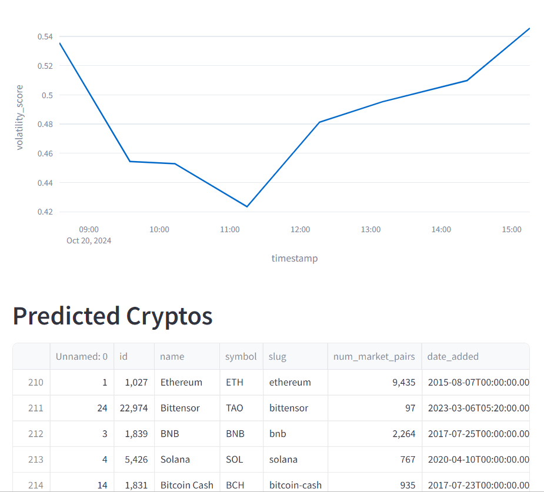
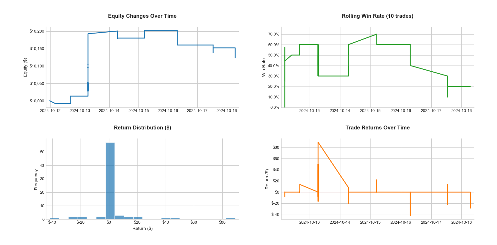
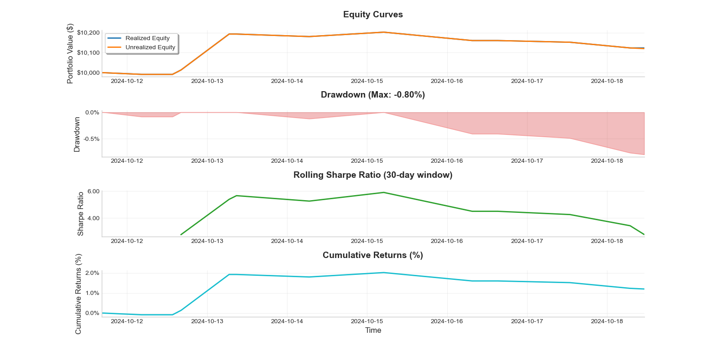

# Cryptocurrency Analyzer

This ongoing project is an advanced cryptocurrency analysis framework designed to identify promising trading opportunities using sophisticated technical analysis, market metrics, and multiple filtering strategies. The framework combines traditional technical indicators with custom metrics for comprehensive market analysis, anomaly detection, and backtesting capabilities.



## Core Features

### Technical Analysis
- **Advanced Technical Indicators**:
  - Moving Averages: SMA (50, 200), EMA (9, 20)
  - Momentum Indicators: MACD, RSI, Stochastic Oscillator, Rate of Change (ROC)
  - Volume Indicators: On Balance Volume (OBV), Accumulation/Distribution (A/D), Chaikin Money Flow (CMF)
  - Volatility Measures: Average True Range (ATR), Bollinger Bands Width
  - Trend Strength Indicators: ADX (Average Directional Index)
  - Custom composite indicators for trend strength and market momentum

### Market Analysis
- **Market Dominance Metrics**:
  - Market cap relative to total market
  - Volume dominance analysis
  - Volume-to-market cap ratio assessment
  - Market stability index
  - Combined market dominance scoring

- **Volume Stability Analysis**:
  - Volume consistency tracking (7-day rolling window)
  - Volume-to-market cap ratio stability
  - Volume-price correlation analysis
  - OBV trend analysis
  - Time-decay weighted volume analysis

### Advanced Filtering Systems

1. **Price Movement Detection**:
   - Statistical spike and crash detection using Z-scores
   - Golden cross detection (SMA 50 crossing above SMA 200)
   - Multi-timeframe momentum analysis
   - Price pattern recognition
   - Price-to-ATR ratio analysis

2. **Volume Analysis**:
   - Sudden volume surge detection
   - Volume-price relationship analysis
   - OBV momentum tracking
   - Volume consistency scoring
   - Volume dominance thresholds

3. **Market Efficiency Filters**:
   - Liquidity assessment using ATR and volatility
   - Market stability index integration
   - Volume/Market cap relationship optimization (0.1 to 0.5 ratio)
   - Price efficiency metrics
   - Anomaly detection using Isolation Forest

4. **Risk Assessment**:
   - Volatility penalty scoring
   - Volume consistency bonus calculations
   - Market cap/volume ratio adjustments
   - Negative flag aggregation
   - Anomaly impact assessment

### Backtesting System

The framework now includes a sophisticated backtesting module with the following capabilities:

1. **Enhanced Risk Management**:
   - Dynamic position sizing based on volatility
   - Multi-factor risk assessment
   - Maximum drawdown control
   - Position correlation analysis
   - Advanced fee modeling

2. **Performance Metrics**:
   - Sharpe Ratio (rolling and overall)
   - Maximum Drawdown tracking
   - Win Rate calculation
   - Profit Factor analysis
   - Risk-adjusted returns
   - Average win/loss metrics
   - Return on initial equity
   - Position-level analytics

3. **Position Management**:
   - Automated entry/exit execution
   - Dynamic stop-loss adjustment
   - Take-profit optimization
   - Position aging analysis
   - Maximum position limits
   - Volume-based position sizing

4. **Visualization Tools**:
   - Equity curves (realized and unrealized)
   - Drawdown visualization
   - Rolling Sharpe Ratio plots
   - Cumulative returns analysis

   

   - Trade distribution charts
   - Performance metrics dashboard

   


### Scoring System
- **Composite Scoring Algorithm**:
  - Market dominance (8%)
  - Volume stability (4%)
  - Price stability (4%)
  - Short-term price changes (8% each for 24h and 7d)
  - RSI divergence (8%)
  - Trend indicators (4% each for uptrend and golden cross)
  - MACD histogram (8%)
  - Bollinger Band width (4%)
  - ADX strength (8%)
  - OBV momentum (4%)
  - Additional technical indicators (2-4% each)
  - Penalty and bonus modifiers based on:
    - Volatility levels
    - Volume consistency
    - Market cap/volume relationships
    - Negative flags count
    - Anomaly detection results

## Installation and Setup

1. **Clone the repository**:
   ```sh
   git clone https://github.com/Arch7399/cryptotrak_v2.git
   cd cryptotrak_v2
   ```

2. **Install Dependencies**:
   ```sh
   pip install -r requirements.txt
   ```

3. **Configuration**:
   Create and update your `.env` file with the following:
   ```python
   API_KEY=your-api-key-here
   SENDER_EMAIL=your-email@example.com
   USER=your-username
   RECIPIENT_EMAIL=recipient@example.com
   ```

4. **Setup Analysis Directory**:
   Create an "Analysis" folder and a "price_difference_dump" folder in your desktop or modify the path in the configuration.

## Usage

### Basic Analysis
```python
python main.py
```

The system will analyze cryptocurrency data and alert with the top 5 performing currencies based on the comprehensive scoring system.

### Backtesting
```python
python backtesting_v1.py
```

This will run the backtesting system with the following capabilities:
- Historical performance analysis
- Risk management evaluation
- Trading strategy validation
- Performance visualization

### Advanced Configuration
The system supports customization of various parameters through the configuration:
- Z-score thresholds for price and volume analysis
- Time decay half-life (default: 6 hours)
- Isolation Forest contamination rate (default: 0.1)
- Scoring weights for different metrics
- Rolling window periods for stability calculations
- Risk management parameters
- Backtesting parameters

## Module Structure

- `promising_currency_pipeline.py`: Core analysis pipeline
  - Data preparation and filtering
  - Technical indicator calculation
  - Anomaly detection
  - Comprehensive scoring system
  - Top performer identification

- `data_processing.py`: Data processing and technical analysis
  - Market dominance calculation
  - Volume stability analysis
  - Technical indicator computation
  - Trend analysis

- `pipeline_filters.py`: Primary filtering mechanisms
  - Price movement detection
  - Volume analysis
  - Market efficiency assessment
  - Risk evaluation

- `pipeline_mixed_filters.py`: Advanced filtering combinations
  - Price-volume correlation analysis
  - Trend strength assessment
  - Reversal opportunity detection
  - Momentum divergence analysis

- `backtesting.py`: Backtesting and performance analysis
  - Historical simulation
  - Risk management system
  - Performance metrics calculation
  - Results visualization

## Contributing

Contributions are welcome! To contribute:

1. Fork the repository
2. Create a feature branch
   ```sh
   git checkout -b feature/your-feature
   ```
3. Commit your changes
   ```sh
   git commit -am 'Add some feature'
   ```
4. Push to the branch
   ```sh
   git push origin feature/your-feature
   ```
5. Submit a Pull Request
